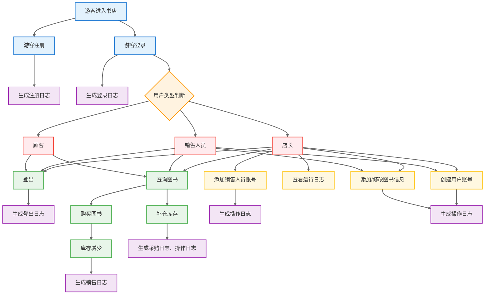
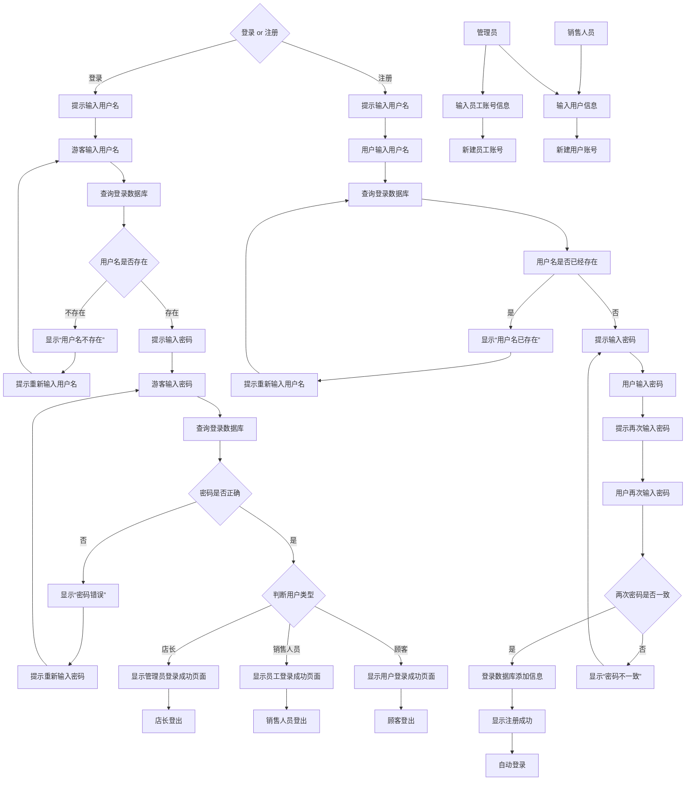
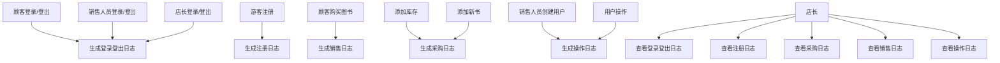
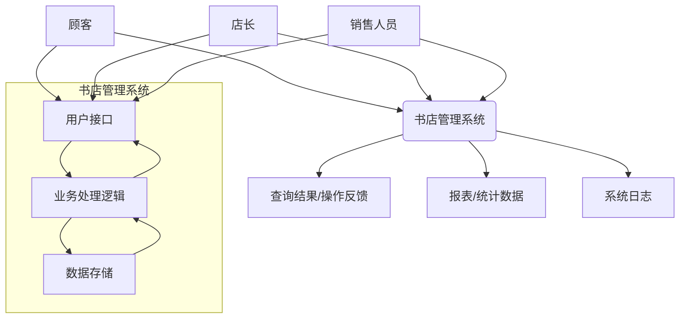
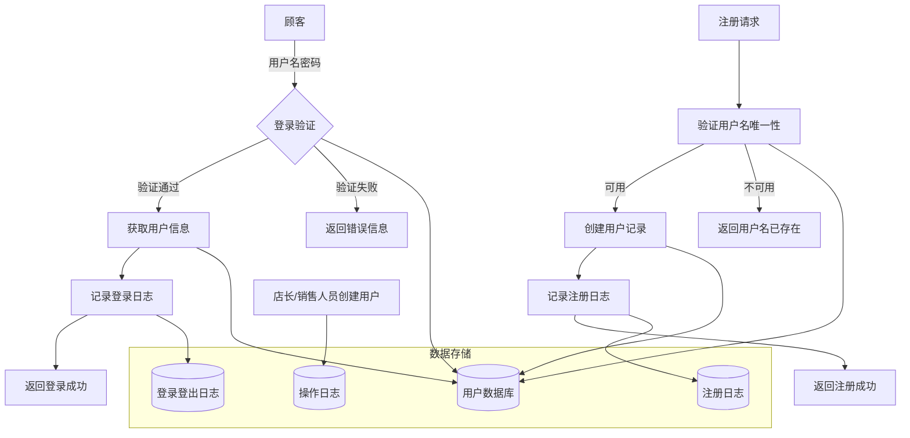
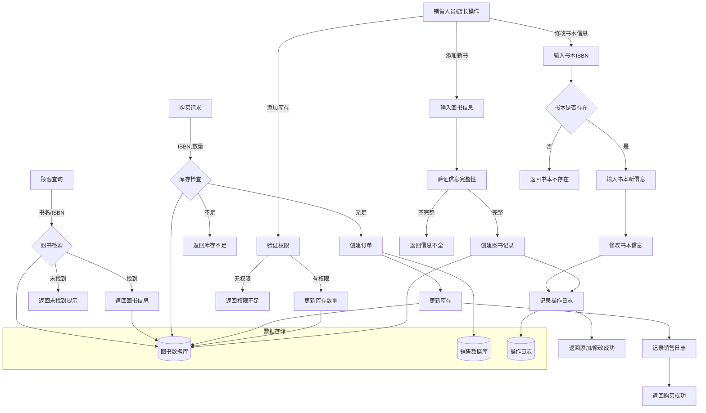
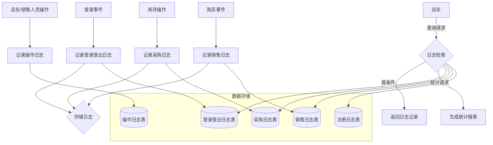

# 需求分析文档
---
## 业务流图
### 总业务流图

### 1.登录子系统

### 2.图书子系统

### 3.日志子系统

---
## 数据流图
### 顶层数据流图

### 1.登录子系统数据流图

### 2.图书子系统数据流图

### 3.日志子系统数据流图


---
## 数据词典
### 1.用户数据库(Users)
| 数据项 | 说明 |
|--------|-----|
|user_id|用户ID|
|username|用户名|
|password|密码（加密）|
|user_type|用户类型:admin/staff/customer|
### 2.图书数据库(Books)
|数据项|说明|
|------|---|
|title|书名|
|isbn|国际标准书号|
|author|作者|
|price|价格|
|keywords|关键词|
|quantity|库存数量|
### 3.登录登出日志表(Loginout_Logs)
|数据项|说明|
|------|---|
|log_id|日志ID|
|user_id|用户ID|
|username|用户名|
|login_time|登录时间|
|logout_time|登出时间|
|status|登录状态|
|fail_reason|失败原因|
### 4.销售日志表(Import_Logs)
|数据项|说明|
|-----|----|
|log_id|日志ID|
|user_id|用户ID|
|book_id|图书ID|
|quantity|进货数量|
|price|进货单价|
|import_time|进货时间|
### 5.销售日志表(Sales_Logs)
|数据项|说明|
|------|----|
|log_id|日志ID|
|order_id|订单ID|
|user_id|用户ID|
|book_id|图书ID|
|quantity|销售数量|
|sale_price|销售单价|
|total_price|总金额|
|sale_time|销售时间|
### 6.注册日志表(Rigester_Logs)
|数据项|说明|
|-----|----|
|log_id|日志ID|
|user_id|用户ID|
|username|用户名|
|password1|第一次密码|
|password2|第二次密码|
|register_time|注册时间|
|status|注册状态|
|fail_reason|失败原因|
### 7.操作日志表(Operetion_Logs)
|数据项|说明|
|-----|----|
|log_id|日志ID|
|user_id|用户ID|
|username|用户名|
|target|操作对象|
|description|操作内容|
|operation_time|操作时间|
### 8.用户登录栈(User_Login_Stack)
|数据项|说明|
|-----|----|
|user_id|用户ID|
---

## 功能说明
### 1.登录子系统功能模块
a. 功能1:用户登录
```
· 模块名称: UserLogin
· 功能描述: 验证用户身份，分配相应权限
· 输入参数:
  · username: 用户名
  · password: 密码
· 输出参数:
  · login_result: 登录结果(success/failed)
  · user_info: 用户信息(用户类型、权限等)
  · error_message: 错误信息(登录失败时)
· 处理逻辑:
  1. 接收用户名和密码
  2. 查询用户数据库验证用户存在性
  3. 验证密码匹配
  4. 检查用户状态(是否激活、锁定)
  5. 将用户列入登录栈(表示登录状态)
  6. 记录登录日志
  7. 返回登录结果和用户信息
```

b. 功能2：用户注册
```
· 模块名称: UserRegister
· 功能描述: 新用户注册账户
· 输入参数:
  · username: 用户名
  · password: 密码
  · confirm_password: 确认密码
· 输出参数:
  · register_result: 注册结果(success/failed)
  · user_id: 用户ID(注册成功)
  · error_message: 错误信息
· 处理逻辑:
  1. 验证用户名唯一性
  2. 验证两次输入密码一致
  3. 创建用户记录
  4. 记录注册日志
  5. 返回注册结果
  6. 自动登录
```

c. 功能3：店长添加销售人员
```
· 模块名称: AddStaff
· 功能描述: 店长添加新的销售人员
· 输入参数:
  · username: 员工用户名
  · password: 初始密码
· 输出参数:
  · add_result: 添加结果(success/failed)
  · staff_id: 员工ID
  · error_message: 错误信息
· 处理逻辑:
  1. 验证管理员权限
  2. 验证用户名唯一性
  3. 创建员工账户(user_type='staff')
  4. 记录操作日志
  5. 返回操作结果
```
d. 功能4:用户登出
```
· 模块名称: UserLogout
· 功能描述: 用户登出
· 输入参数:
  · username: 用户名
· 输出参数:
  · logout_result: 登出结果(success/failed)
· 处理逻辑:
  1. 接收用户名
  2. 检查用户是否已登录
  3. 用户退出登录栈
  4. 记录登出日志
```
e. 功能5:创建用户（需要销售人员/店长权限）
```
· 模块名称: UserAdd
· 功能描述: 销售人员/店长创建新的用户账户
· 输入参数:
  · username: 用户名
· · password: 密码
  · confirm_password: 确认密码
· 输出参数:
  · register_result: 注册结果(success/failed)
  · user_id: 用户ID(注册成功)
  · error_message: 错误信息
· 处理逻辑:
  1. 验证销售人员/店长权限
  2. 验证用户名唯一性
  3. 验证两次输入密码一致
  4. 创建用户记录
  5. 记录操作日志
  6. 返回注册结果
```
### 2.图书子系统功能模块
a.功能6：图书查询
```
· 模块名称: BookSearch
· 功能描述: 根据条件查询图书信息
· 输入参数:
  · book_isbn: 国际标准书号
  · book_title: 图书名称
  · book_author: 作者
  · book_keyeords: 关键词
  · book_price: 图书单价
  · book_quantity: 图书库存
  以上中的任意项/几项
· 输出参数:
  · book_isbn: 国际标准书号
  · book_title: 图书名称
  · book_author: 作者
  · book_keyeords: 关键词
  · book_price: 图书单价
  · book_quantity: 图书库存
  如果有多本书符合条件的话，按标准书号顺序输出
· 处理逻辑:
  1. 验证图书存在
  2. 读取图书数据库信息
  3. 记录操作日志
  4. 返回图书信息
```

b.功能7：图书购买
```
· 模块名称: BookPurchase
· 功能描述: 用户购买图书，处理订单
· 输入参数:
  · user_id: 用户ID
  · isbn: 图书ISBN号
  · quantity: 购买数量
· 输出参数:
  · order_result: 订单处理结果(success/failed)
  · order_info: 订单信息(订单号、金额等)
  · error_message: 错误信息
· 处理逻辑:
  1. 验证用户存在性和状态
  2. 检查每本图书库存是否充足
  3. 计算订单总金额
  4. 创建订单记录
  5. 更新库存数量
  6. 记录销售日志
  7. 返回订单处理结果
```

c.功能8：库存管理
```
· 模块名称: InventoryManagement
· 功能描述: 管理图书库存，包括添加库存、调整库存
· 输入参数:
  · operation_type: 操作类型
  · isbn: 图书ISBN号
  · quantity: 数量(添加或调整)
· 输出参数:
  · operation_result: 操作结果
  · current_quantity: 当前库存量
  · error_message: 错误信息
· 处理逻辑:
  1. 验证操作员权限(销售人员/店长)
  2. 检查图书是否存在
  3. 根据操作类型更新库存
  4. 记录操作日志
  5. 返回操作结果
```

d.功能9：图书信息管理
```
· 模块名称: BookInfoManagement
· 功能描述: 管理图书基本信息，包括添加、修改、删除
· 输入参数:
  · operation_type: 操作类型(add/update/delete)
  · book_data: 图书数据(ISBN、书名、作者等)
· 输出参数:
  · operation_result: 操作结果
  · book_info: 图书信息(添加或更新后)
  · error_message: 错误信息
· 处理逻辑:
  1. 验证操作员权限(店长)
  2. 验证图书数据完整性
  3. 根据操作类型执行相应操作
  4. 记录操作日志
  5. 返回操作结果
```

### 3.日志子系统功能模块
a.功能10：登录登出日志查询
```
· 模块名称: LoginLogQuery
· 功能描述: 查询用户登录日志
· 输入参数:
  · start_date: 开始日期
  · end_date: 结束日期
· 输出参数:
  · log_list: 日志列表
  · total_count: 总记录数
· 处理逻辑:
  1. 验证查询权限(店长)
  2. 构建查询条件
  3. 从登录日志表检索数据
  4. 返回日志列表
```

b.功能11：采购日志查询
```
· 模块名称: ImportLogQuery
· 功能描述: 查询采购日志
· 输入参数:
  · start_date: 开始日期
  · end_date: 结束日期
· 输出参数:
  · log_list: 日志列表
  · total_count: 总记录数
· 处理逻辑:
  1. 验证查询权限(店长)
  2. 构建查询条件
  3. 从采购日志表检索数据
  4. 返回日志列表
```

c.功能12：注册日志查询
```
· 模块名称: RegisterLogQuery
· 功能描述: 查询注册日志
· 输入参数:
  · start_date: 开始日期
  · end_date: 结束日期
· 输出参数:
  · log_list: 日志列表
  · total_count: 总记录数
· 处理逻辑:
  1. 验证查询权限(店长)
  2. 构建查询条件
  3. 从注册日志表检索数据
  4. 返回日志列表
```

d.功能13：销售日志查询
```
· 模块名称: SalesLogQuery
· 功能描述: 查询销售日志
· 输入参数:
  · start_date: 开始日期
  · end_date: 结束日期
· 输出参数:
  · log_list: 日志列表
  · total_count: 总记录数
· 处理逻辑:
  1. 验证查询权限(店长)
  2. 构建查询条件
  3. 从销售日志表检索数据
  4. 返回日志列表
```
e.功能14：操作日志查询
```
· 模块名称: OperationLogQuery
· 功能描述: 查询操作日志
· 输入参数:
  · start_date: 开始日期
  · end_date: 结束日期
· 输出参数:
  · log_list: 日志列表
  · total_count: 总记录数
· 处理逻辑:
  1. 验证查询权限(店长)
  2. 构建查询条件
  3. 从操作日志表检索数据
  4. 返回日志列表
```
---
## 用户交互设计
### 1.登录登出模块
#### 1.1注册账号
```
-输入：register <username> <password1> <password2>
-输出： Register success.Your ID is <user_id>.(注册成功)
       The username already exists.(用户名已存在)
       The two passwords do not match.(两次密码不一致)
```
#### 1.2登录账号
```
-输入：login <username> <password>
       或login <user_id> <password>
-输出： Login success.(登录成功)
       The username doesn't exist.(用户名不存在)
       The password doesn't correct.(密码不正确)
```
#### 1.3登出账号
```
-输入：logout
-输出：Logout success.(登出成功)
```
#### 1.4创建员工账号(需要店长权限)
```
-输入：add staff <username> <password1> <password2>
-输出：Add staff success.The staff ID is <staff_id>.(添加成功)
       The username already exists.(用户名已存在)
       The two passwords do not match.(两次密码不一致)
```
#### 1.5创建用户（需要店长/销售人员权限）
```
-输入：add user <username> <password1> <password2>
-输出：Add user success.The staff ID is <staff_id>.(添加成功)
       The username already exists.(用户名已存在)
       The two passwords do not match.(两次密码不一致)
```
### 2.图书管理模块
#### 2.1写入图书信息(需要店长/销售人员权限)
```
-输入：add newbook
      title=<title>
      isbn=<isbn>
      author=<author>
      keywords=<kewords>
      price=<price>
      quantity=<quantity>
-输出：Add new book success..(写入成功)
      The book already exists.(书本已存在)
```
#### 2.2修改图书信息(需要店长/销售人员权限)
```
-输入: update <isbn> author=<author> keywords=<kerwords> price=<price>(其中的任意组合)
-输出：Update success.(修改成功)
      The book doesn't exist.(书本不存在)
```
#### 2.3删除图书(需要店长/销售人员权限)
```
-输入: delete <isbn>
-输出：Delete success.(修改成功)
      The book doesn't exist.(书本不存在)
```
#### 2.4进货(需要店长/销售人员权限)
```
-输入：import <isbn> <quantity> <price>
-输出：import success.(进货成功)
      The book doesn't exist.(书本不存在)
```
#### 2.5查询图书信息
```
-输入：show isbn=<isbn> title=<title> author=<author> keywords=<keywords>(其中的任意组合)
-输出：按顺序输出符合要求的书本相关信息(title,isbn,author,keywords)
    The relevant books do not exist.(相关书籍不存在)
```
#### 2.6购买图书
```
-输入: buy <isbn> <quantity>
-输出: Purchase successful.(购买成功)
       Insufficient inventory.(库存不足)
```
### 3.日志模块(需要店长权限)
#### 3.1查询登录登出日志
```
-输入: loginout <l> <r> (<user_name>)
-输出：显示登录登出日志从时间l到r的信息
```
#### 3.2查询注册日志
```
-输入: logregister <l> <r>
-输出：显示注册日志从时间l到r的信息
```
#### 3.3查询采购日志
```
-输入: logimport <l> <r>
-输出：显示采购日志从时间l到r的信息，按照采购顺序输出采购图书的 ISBN 号、数量、单价等
```
#### 3.4查询销售日志
```
-输入: logsales <l> <r>
-输出：显示销售日志从时间l到r的信息，按照销售顺序输出售出图书的 ISBN 号、数量、单价等
```
#### 3.5查询操作日志
```
-输入: logoperation <l> <r>
-输出：显示操作日志从时间l到r的信息，按操作顺序输出每次操作类型及其对象，如创建用户操作以及对应的用户信息
```
### 4.统计模块（需要店长权限）
#### 4.1统计盈利
```
-输入: show sales <l> <r>
-输出：一个数字，统计注册日志从时间l到r的销售收入总额
```
#### 4.2统计支出
```
-输入: show outlay <l> <r>
-输出：一个数字，统计注册日志从时间l到r的支出总额
```
#### 4.3统计盈利
```
-输入: show profit <l> <r>
-输出：一个数字，统计注册日志从时间l到r的盈利总额
```
#### 4.4统计员工工作报告
```
-输入: report <user_name>
      或report <user_id>
-输出：该员工的工作情况报告（即按操作顺序输出每次操作类型及其对象，如创建用户操作以及对应的用户信息）
      This is not an employee!(user_name/user_id不是员工)
```
#### 4.5统计系统日志
```
-输入: log <l> <r>
-输出：按时间顺序显示所有日志从时间l到r的信息
```