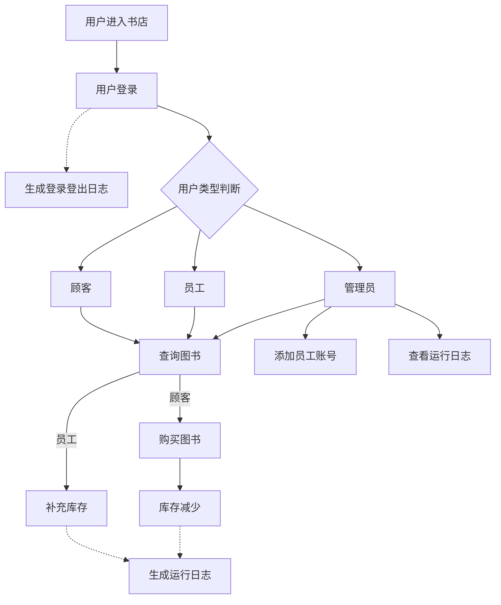
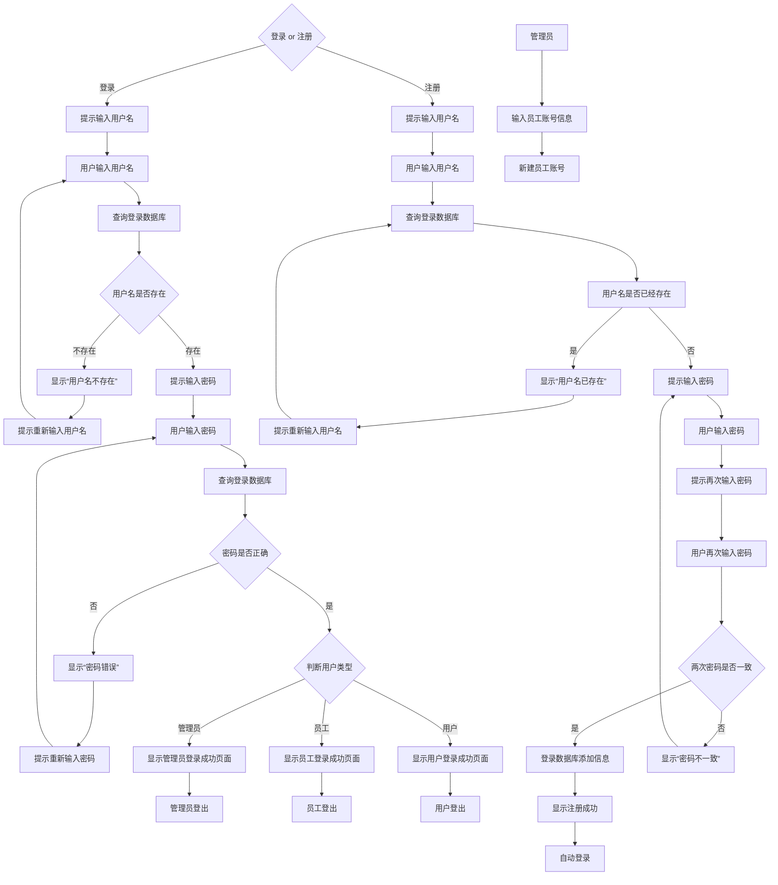
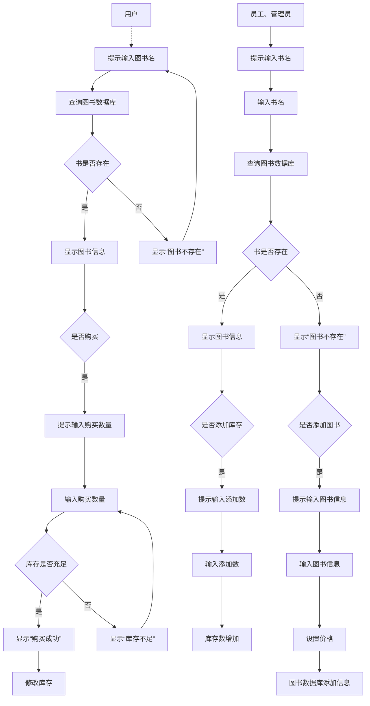
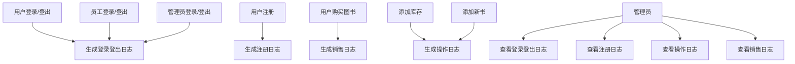
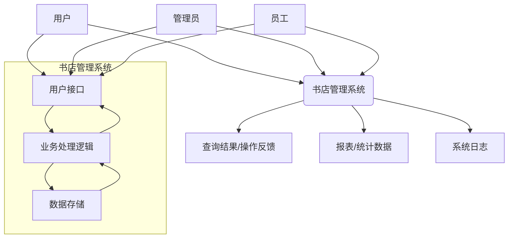
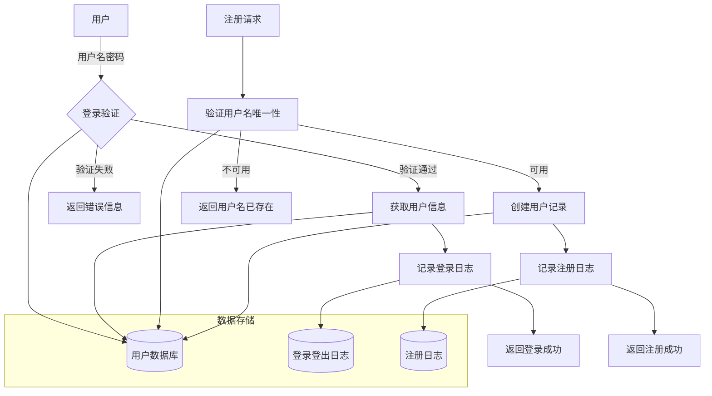
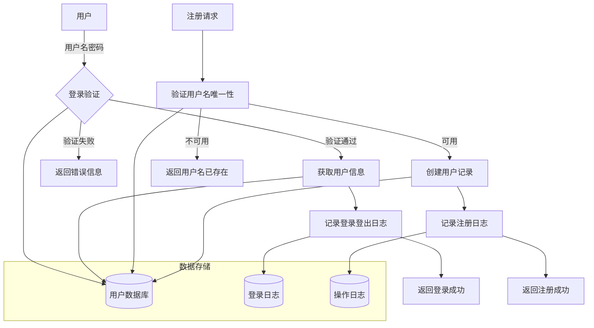
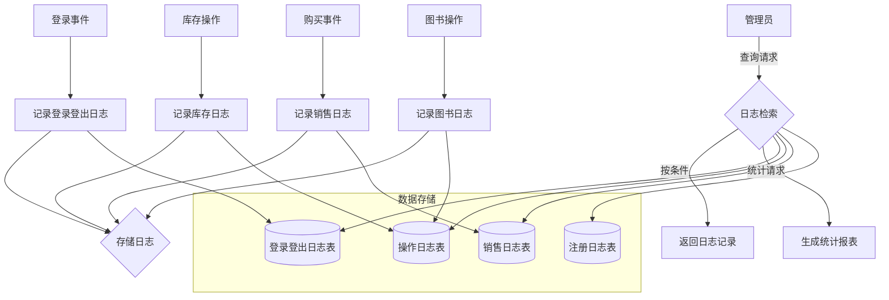

# 需求分析文档
---
## 业务流图
### 总业务流图

### 1.登录子系统

### 2.图书子系统

### 3.日志子系统

---
## 数据流图
### 顶层数据流图

### 1.登录子系统数据流图

### 2.图书子系统数据流图

### 3.日志子系统数据流图


---
## 数据词典
### 1.用户数据库(Users)
| 数据项 | 说明 |
|--------|-----|
|user_id|用户ID|
|username|用户名|
|password|密码（加密）|
|user_type|用户类型:admin/staff/customer|
|status|用户状态|
|register_time|注册时间|
|last_login|最后登陆时间|
### 2.图书数据库(Books)
|数据项|说明|
|------|---|
|book_id|图书ID|
|title|书名|
|isbn|国际标准书号|
|author|作者|
|publisher|出版社|
|publish_date|出版日期|
|category|图书分类|
|price|价格|
|description|图书描述|
|create_time|创建时间|
|update_time|更新时间|
|quantity|库存数量|
|last_restock_time|最后补货时间|
|last_restock_quantity|最后补货数量|
|last_sale_time|最后销售时间|
|last_sale_quantity|最后销售数量|
### 3.登录登出日志表(Loginout_Logs)
|数据项|说明|
|------|---|
|log_id|日志ID|
|user_id|用户ID|
|username|用户名|
|login_time|登录时间|
|logout_time|登出时间|
|status|登录状态|
|fail_reason|失败原因|
### 4.操作日志表(Operation_Logs)
|数据项|说明|
|-----|----|
|log_id|日志ID|
|user_id|用户ID|
|operation_type|操作类型|
|target_object|操作对象|
|operation_detail|操作详情|
|operation_time|操作时间|
|result|操作结果|
### 5.销售日志表(Sales_Logs)
|数据项|说明|
|------|----|
|log_id|日志ID|
|order_id|订单ID|
|user_id|用户ID|
|book_id|图书ID|
|quantity|销售数量|
|sale_price|销售单价|
|total_price|总金额|
|sale_time|销售时间|
### 6.注册日志表(Rigester_Logs)
|数据项|说明|
|-----|----|
|log_id|日志ID|
|user_id|用户ID|
|username|用户名|
|password1|第一次密码|
|password2|第二次密码|
|register_time|注册时间|
|status|注册状态|
|fail_reason|失败原因|

---

## 功能说明
### 1.登录子系统功能模块
a. 功能1:用户登录
```
· 模块名称: UserLogin
· 功能描述: 验证用户身份，分配相应权限
· 输入参数:
  · username: 用户名
  · password: 密码
· 输出参数:
  · login_result: 登录结果(success/failed)
  · user_info: 用户信息(用户类型、权限等)
  · error_message: 错误信息(登录失败时)
· 处理逻辑:
  1. 接收用户名和密码
  2. 查询用户数据库验证用户存在性
  3. 验证密码匹配
  4. 检查用户状态(是否激活、锁定)
  5. 记录登录日志
  6. 返回登录结果和用户信息
```

b. 功能2：用户注册
```
· 模块名称: UserRegister
· 功能描述: 新用户注册账户
· 输入参数:
  · username: 用户名
  · password: 密码
  · confirm_password: 确认密码
· 输出参数:
  · register_result: 注册结果(success/failed)
  · user_id: 用户ID(注册成功)
  · error_message: 错误信息
· 处理逻辑:
  1. 验证用户名唯一性
  2. 验证两次输入密码一致
  3. 创建用户记录
  4. 记录注册日志
  5. 返回注册结果
```

c. 功能3：管理员添加员工
```
· 模块名称: AddStaff
· 功能描述: 管理员添加新的员工账户
· 输入参数:
  · username: 员工用户名
  · password: 初始密码
· 输出参数:
  · add_result: 添加结果(success/failed)
  · staff_id: 员工ID
  · error_message: 错误信息
· 处理逻辑:
  1. 验证管理员权限
  2. 验证用户名唯一性
  3. 创建员工账户(user_type='staff')
  4. 记录操作日志
  5. 返回操作结果
```
a. 功能4:用户登出
```
· 模块名称: UserLogout
· 功能描述: 用户登出
· 输入参数:
  · username: 用户名
· 输出参数:
  · logout_result: 登出结果(success/failed)
· 处理逻辑:
  1. 接收用户名
  2. 检查用户是否已登录
  3. 改变用户登录状态
  4. 记录登出日志
```
### 2.图书子系统功能模块
a.功能5：图书查询
```
· 模块名称: BookSearch
· 功能描述: 根据条件查询图书信息
· 输入参数:
  · book_name: 图书名称
· 输出参数:
  · book_id: 图书ID
  · book_isbn: 国际标准书号
  · book_author: 作者
  · book_publisher: 出版社
  · publish_date: 出版日期
  · book_category: 图书分类
  · book_price: 图书单价
  · book_description: 图书描述
  · book_quantity: 图书库存
· 处理逻辑:
  1. 验证图书存在
  2. 读取图书数据库信息
  3. 记录操作日志
  4. 返回图书信息
```

b.功能6：图书购买
```
· 模块名称: BookPurchase
· 功能描述: 用户购买图书，处理订单
· 输入参数:
  · user_id: 用户ID
  · book_id: 图书ID
  · quantity: 购买数量
· 输出参数:
  · order_result: 订单处理结果(success/failed)
  · order_info: 订单信息(订单号、金额等)
  · error_message: 错误信息
· 处理逻辑:
  1. 验证用户存在性和状态
  2. 检查每本图书库存是否充足
  3. 计算订单总金额
  4. 创建订单记录
  5. 更新库存数量
  6. 记录销售日志
  7. 返回订单处理结果
```

c.功能7：库存管理
```
· 模块名称: InventoryManagement
· 功能描述: 管理图书库存，包括添加库存、调整库存
· 输入参数:
  · operation_type: 操作类型
  · book_id: 图书ID
  · quantity: 数量(添加或调整)
· 输出参数:
  · operation_result: 操作结果
  · current_quantity: 当前库存量
  · error_message: 错误信息
· 处理逻辑:
  1. 验证操作员权限(员工或管理员)
  2. 检查图书是否存在
  3. 根据操作类型更新库存
  4. 记录库存操作日志
  5. 返回操作结果
```

d.功能8：图书信息管理
```
· 模块名称: BookInfoManagement
· 功能描述: 管理图书基本信息，包括添加、修改、删除
· 输入参数:
  · operation_type: 操作类型(add/update/delete)
  · book_data: 图书数据(ISBN、书名、作者等)
  · book_id: 图书ID(更新或删除时需要)
· 输出参数:
  · operation_result: 操作结果
  · book_info: 图书信息(添加或更新后)
  · error_message: 错误信息
· 处理逻辑:
  1. 验证操作员权限(管理员)
  2. 验证图书数据完整性
  3. 根据操作类型执行相应操作
  4. 记录图书操作日志
  5. 返回操作结果
```

### 3.日志子系统功能模块
a.功能9：登录登出日志查询
```
· 模块名称: LoginLogQuery
· 功能描述: 查询用户登录日志
· 输入参数:
  · start_date: 开始日期
  · end_date: 结束日期
· 输出参数:
  · log_list: 日志列表
  · total_count: 总记录数
  · statistics: 统计信息(成功次数、失败次数等)
· 处理逻辑:
  1. 验证查询权限(管理员)
  2. 构建查询条件
  3. 从登录日志表检索数据
  4. 生成统计信息
  5. 返回日志列表和统计信息
```

b.功能10：操作日志查询
```
· 模块名称: OperationLogQuery
· 功能描述: 查询系统操作日志
· 输入参数:
  · start_date: 开始日期
  · end_date: 结束日期
· 输出参数:
  · log_list: 日志列表
  · total_count: 总记录数
  · operation_statistics: 操作类型统计
· 处理逻辑:
  1. 验证查询权限(管理员)
  2. 构建查询条件
  3. 从操作日志表检索数据
  4. 统计各类操作次数
  5. 返回日志列表和统计信息
```

c.功能11：注册日志查询
```
· 模块名称: RegisterLogQuery
· 功能描述: 查询注册日志
· 输入参数:
  · start_date: 开始日期
  · end_date: 结束日期
· 输出参数:
  · log_list: 日志列表
  · total_count: 总记录数
  · operation_statistics: 操作类型统计
· 处理逻辑:
  1. 验证查询权限(管理员)
  2. 构建查询条件
  3. 从操作日志表检索数据
  4. 统计各类操作次数
  5. 返回日志列表和统计信息
```

d.功能12：销售日志查询
```
· 模块名称: SalesLogQuery
· 功能描述: 查询销售日志
· 输入参数:
  · start_date: 开始日期
  · end_date: 结束日期
· 输出参数:
  · log_list: 日志列表
  · total_count: 总记录数
  · operation_statistics: 操作类型统计
· 处理逻辑:
  1. 验证查询权限(管理员)
  2. 构建查询条件
  3. 从操作日志表检索数据
  4. 统计各类操作次数
  5. 返回日志列表和统计信息
```
---
## 用户交互设计
### 1.登录登出模块
#### 1.1注册账号
```
-输入：register <username> <password1> <password2>
-输出： Register success.Your ID is <user_id>.(注册成功)
       The username already exists.(用户名已存在)
       The two passwords do not match.(两次密码不一致)
```
#### 1.2登录账号
```
-输入：login <username> <password>
       或login <user_id> <password>
-输出： Login success.(登录成功)
       The username doesn't exist.(用户名不存在)
       The password doesn't correct.(密码不正确)
```
#### 1.3登出账号
```
-输入：logout
-输出：Logout success.(登出成功)
```
#### 1.4创建员工账号(需要管理员权限)
```
-输入：add staff <username> <password1> <password2>
-输出：Add staff success.The staff ID is <staff_id>.(添加成功)
       The username already exists.(用户名已存在)
       The two passwords do not match.(两次密码不一致)
```
### 2.图书管理模块
#### 2.1写入图书信息(需要管理员权限)
```
-输入：add newbook <title>
      isbn=<isbn>
      author=<author>
      publisher=<publisher>
      publish date=<publish_date>
      category=<category>
      description=<description>
      price=<price>
      quantity=<quantity>
-输出：Add new book success.The book ID is <book_id>.(写入成功)
      The book already exists.(书本已存在)
```
#### 2.2修改图书信息(需要管理员权限)
```
-输入: update <book_id> isbn=<isbn> author=<author> publisher=<publisher> publish date=<publish_date> category=<category> description=<description> price=<price>(其中的任意组合)
-输出：Update success.(修改成功)
      The book doesn't exist.(书本不存在)
```
#### 2.3删除图书(需要管理员权限)
```
-输入: delete <book_id>
-输出：Delete success.(修改成功)
      The book doesn't exist.(书本不存在)
```
#### 2.4添加图书库存(需要管理员/员工权限)
```
-输入：import <book_id> <quantity>
-输出：import success.(添加成功)
      The book doesn't exist.(书本不存在)
```
#### 2.5减少图书库存(需要管理员/员工权限)
```
-输入：reduce book <book_id> <quantity>
-输出：Reduce book success.(添加成功)
      The book doesn't exist.(书本不存在)
      Insufficient inventory.(库存不足)
```
#### 2.6查询图书信息
```
-输入：show book_id=<book_id> isbn=<isbn> title=<title> author=<author> publisher=<publisher> category=<category> (其中的任意组合)
-输出：按顺序输出符合要求的书本相关信息(book_id,title,isbn,author,publisher,publish_date,category,description,create_time,update_time,price,quantity,last_restock_time,last_restock_quantity,last_sale_time,last_sale_quantity)
    The relevant books do not exist.(相关书籍不存在)
```
#### 2.7购买图书
```
-输入: buy <book_id> <quantity>
-输出: Purchase successful.(购买成功)
       Insufficient inventory.(库存不足)
```
### 3.日志模块
#### 3.1查询登录登出日志
```
-输入: loginout <l> <r> (<user_name>)
-输出：显示登录登出日志从时间l到r的信息
```
#### 3.2查询注册日志
```
-输入: logregister <l> <r>
-输出：显示注册日志从时间l到r的信息
```
#### 3.3查询操作日志
```
-输入: logoperation <l> <r> (<user_name>)
-输出：显示操作日志从时间l到r的信息
```
#### 3.4查询销售日志
```
-输入: logsales <l> <r>
-输出：显示销售日志从时间l到r的信息
```
#### 3.5统计盈利
```
-输入: show_sales <l> <r> (<book_id>)
-输出：一个数字，统计注册日志从时间l到r的销售总额
```